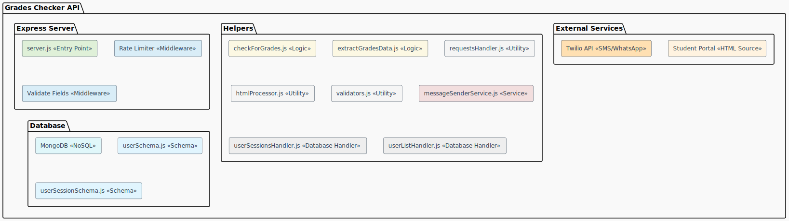
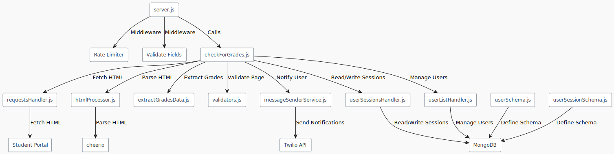

# Grades Checker And Notifier API*

## "Disclaimer"

****The author of this script is not responsible for any damage caused by the use of this script. Use it at your own risk.***

## Sections

- [Problem Statement](#problem-statement)
- [Screenshots](#screenshots)
- [How to Use the API](#how-to-use-the-api)
- [Token Retrieval](#token-retrieval)
- [Key Features](#key-features)
- [System Overview](#system-overview)
- [Hosting](#hosting)
- [Final Words](#final-words)

## Problem statement <a name="problem-statement"></a>

 I am a student at the Faculty of Science, Alexandria University (AUFS). The university has a website where students can check their grades. However, the website is not very user-friendly, and it requires students to log in every time they want to check their grades. This is a problem for me because I often forget to check my grades. That's when I decided to create a script that will check my grades for me and notify me when they are available. I also wanted to make the script easy to use, so I decided to create a **REST API** that can be used by anyone who wants to check their grades.

**Quick note:** Make sure you are calling the API from a computer not using a mobile app because it does not work there. Use a tool like Postman as this tool is tested and it's working with it.

## Screenshots <a name="screenshots"></a>

**Login page:**

*The login page of the website.*

**Main page:**

*Once you log in, you will be redirected to the main page of the website. This page contains all the information about the student:*

- The student's full name
- The student's department
- Credit hours
- CGPA
- and other information.

**Grades page:**

*This is the page where the students can check their grades.*

The page contains a table for each semester, with the info about the courses the student has enrolled into as shown in the image above.
Please note that the website is in **Arabic**, and all the course names are in **Arabic**, I translated the site so anyone would understand the concept. So the API will send the grades in Arabic (as how you will see later) since **the website is in Arabic by default.**.

## Let me explain how to use the API <a name="how-to-use-the-api"></a>

1. You just need to call the **/start** endpoint with the following parameters:

    ```json
    POST /start HTTP/1.1
    {
        "username": "your_username",
        "phoneNumber": "your_phone_number", 
        "token": "your_token"
    }
    ```

    - **username** (**string**): your username (the one you use to log in to the website, however, you can use anything as a username, it will be used to identify the user in the database)
    - **phoneNumber** (**string**): your phone number (the one you use to receive the notification). **Make sure it is in <a href="https://faq.whatsapp.com/1294841057948784" target="_blank"><u>valid WhatsApp phone number format</u></a>.**
    - **token** (**string**): I was lazy in the implementation of the API, so you will just need to log in to the website once and copy the token from the url. As this approach was the easiest for me to implement. (**I will explain how to get the token in the next section**)

**Example call**:

 ```json
 POST /start HTTP/1.1
    {
        "username": "2024123456",
        "phoneNumber": "+201234567890",
        "token": "your_token"
    }
 ```

 **Returns**:

```json
201 Created
    {
        "message": "Grade checking service started."
    }
```

### To get the token, just follow these steps: <a name="token-retrieval"></a>

- Open the website in your browser and log in to your account.
- Once logged in, the url should look like this:

```bash
https://www.scialex.org/S/your_token/Student/2018
```

- Just copy the token from the url and paste it in the token parameter in the API. That's it!
- The token will be used to authenticate the user and get the grades.
- If the token expires for any reason, you will be notified via WhatsApp. And you will need to log in again and get a new token.
- The token will be stored in the database and will be used to authenticate the user in the future.

- The API will check if the user is already registered in the database. If not, it will register the user and store the token in the database and send a message via WhatsApp to the user with a message like this:

```text
"Hello! You have successfully registered to the grades checker API. You will be notified via SMS when your grades are available."
*Your username*: 'your_username'
*Your Pending Courses*: 'List of all pending courses'
*Your current CGPA*: 'your_current_cgpa'
```

The API will regularly check the grades every **9 minutes**, and that was achieved by using cron-jobs, and if any grades had been revealed, it will send a message via SMS to the user with the revealed grades and the current CGPA. The message will look like this:


*Notification sent as an SMS message.*

**Sometimes, you would get a response like this:**

```json
500 Internal Server Error
    {
        "error": "Error starting background process for {username}: $ is not a function"
    }
```

- This error started appearing after I deployed it to the cloud. Sometimes the image instance might not be completely ready at the moment of the call. **This is a known issue and I am working on fixing it**. However, you can just ignore it and resend the request again and the API will work as expected.

I implemented the checking logic to check the **Appreciation** column, by default after you completed the course's survey, the grade for the course is **'P'** indicating that the grade is not revealed yet. Once the grade is revealed, it will be changed to **'A'** or **'B'** or any other grade. So I just check if the grade is 'P' or not. If it is not 'P', then the grade is revealed and I will send a message to the user with the revealed grades and the current CGPA.

Once all grades are revealed, the API will stop checking the grades, delete all the user's data, and will send a message via WhatsApp to the user with a message like this:

```text
"Hello! All your grades are revealed. Your current CGPA is {cgpa}. Thank you for using the grades checker API."
```

- The API will also send a message to the user via WhatsApp, if the token expires and the user would need to log in again and get a new token, then call the **/start** endpoint again. The message will look like this:

```text
"Hello! Your token has expired. Please log in again and get a new token. Thank you for using the grades checker API."
```

However, if you decide to stop the service at anytime, you can just call the **/stop** endpoint with the following parameters:

```json
DELETE /stop HTTP/1.1
    {
        "username": "your_username"
    }
```

 **Returns**:

```json
200 Ok
{
 "message": "Grade checking service stopped for user {username}."
}
```

- The API will stop checking the grades and will send a message to the user with some info about how many minutes he had subscribed to the service with the start and end times. The message would look like this:

```text
"Hello! You have successfully stopped the grades checker API. Thank you for using the grades checker API."
Info:
*Duration*: x minutes
*Start date*: DD/MM/YYYY, HH/MM/SS (24-hour format)
*End date*: DD/MM/YYYY, HH/MM/SS (24-hour format)
```

- **The API will also delete the user and all their info from the database.**

## Key Features <a name="key-features"></a>

- The API supports sending notifications via SMS and WhatsApp when grades are available.
- Users can register and unregister from the grades checking service easily.
- The API checks the grades every **9 minutes** and sends notifications when grades are available.
- The API will tell the user if there are any courses that are not polled yet (استبيان) so they can go and fill the survey for the course.
- The API will also send a message to the user if the token expires and the user would need to log in again and get a new token.
- The API will also notify users when their grades are available via **SMS** and **WhatsApp**.

## Additional Features

I implemented a rate limiting feature to prevent abuse of the API. The API will limit the number of requests to **100 requests every 15 minutes**. If the user exceeds this limit, the API will return a **429 Too Many Requests** error.

## System Overview <a name="system-overview"></a>


*Component Diagram*


*Call Flow Diagram*

## Hosting <a name="hosting"></a>

Well, I needed to host the API somewhere, so based on my use case, I decided to use **<a href="https://railway.app/">Railway</a>**. The API is hosted on a free tier, as the API is not very heavy and does not require a lot of resources. But if the API is used by a lot of users, I would need to upgrade the plan, and I don't think I will do that. So the solution for you would be to either:

1. **Host it on your own server (if you have one).**
2. **Use a free hosting service like Heroku, Railway or Render.**
3. **Use a container service like Docker and host it on your own machine (which I highly recommend).**
4. **Use a cloud service like AWS or Azure (which I don't recommend as it is expensive).**

## Final words <a name="final-words"></a>

In the end, this is a script I did for fun and because I am lazy and I don't want to check my grades every time. **I am not responsible for any damage caused by the use of this script. Use it at your own risk.** I hope you find it useful.
